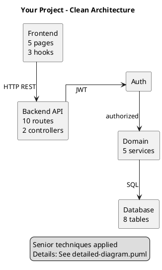

# 🎨 Senior-Level PlantUML Techniques - Jak Unikać "Spaghetti Lines"

## ❌ Problem: "Spaghetti Diagram"

Twój screenshot pokazuje klasyczny problem:
- Linie krzyżują się w wielu miejscach
- Niemożliwe do śledzenia przepływu danych
- Wygląda nieprofesjonalnie na prezentacjach
- Trudne do zrozumienia dla non-technical stakeholders

## ✅ Rozwiązanie: 7 Senior-Level Techniques

### 1. **Ortho Linetype** (Podstawa)
```plantuml
skinparam linetype ortho
```
**Efekt:** Linie pod kątem 90° (jak na schematach elektrycznych)  
**Kiedy używać:** ZAWSZE w diagramach komponentów

---

### 2. **Layout Direction**
```plantuml
' Dla flow charts - poziomo
left to right direction

' Dla hierarchii - pionowo
top to bottom direction
```
**Efekt:** Kontrola głównego przepływu  
**Best practice:** Left-to-right dla prezentacji, Top-to-bottom dla dokumentacji

---

### 3. **Directional Arrows** (Kluczowe!)
```plantuml
' Zamiast:
ComponentA --> ComponentB

' Używaj:
ComponentA -right-> ComponentB
ComponentA -down-> ComponentC
ComponentA -up-> ComponentD
ComponentA -left-> ComponentE
```
**Efekt:** PlantUML szanuje kierunek, mniej krzyżujących się linii  
**Kiedy używać:** Przy KAŻDEJ relacji

---

### 4. **Hidden Lines for Layout**
```plantuml
' Niewidoczne linie kontrolują spacing
Frontend -[hidden]right-> Backend
Backend -[hidden]right-> Database

' Można stackować dla większej przestrzeni
Component1 -[hidden]down-> Component2
Component2 -[hidden]down-> Component3
```
**Efekt:** Kontrola layoutu bez wizualnego szumu  
**Senior trick:** To odróżnia profesjonalny diagram od amatorskiego

---

### 5. **Logical Grouping** (Nie pokazuj wszystkiego!)
```plantuml
' ❌ ŹLE: Pokazywanie 50 relacji
Service1 --> Table1
Service1 --> Table2
Service1 --> Table3
... (50 linii)

' ✅ DOBRZE: Grupowanie
[7 Services] --> [Supabase Client] : "data access"
[Supabase Client] --> [16 Tables] : "SQL"
```
**Efekt:** 2 linie zamiast 50  
**Filozofia:** "Senior diagram shows INTENT, not DETAILS"

---

### 6. **Color Coding for Debt**
```plantuml
' Normal flow - czarna linia
RouteA --> ControllerA --> ServiceA

' Tech debt - czerwona przerywaną
RouteB -[#FF6B6B,dashed]-> ServiceB : ⚠️ skips controller

' Inheritance - zielona bold
BaseClass -[#00C853,bold]-> ChildClass : <<extends>>
```
**Efekt:** Wizualna hierarchia ważności  
**Senior level:** Transparentność o problemach (nie ukrywamy tech debt)

---

### 7. **Spacing Control**
```plantuml
skinparam nodesep 80    ' Horizontal spacing between nodes
skinparam ranksep 100   ' Vertical spacing between ranks
skinparam Padding 25    ' Internal padding
```
**Efekt:** Więcej white space = mniej clutter  
**Best practice:** nodesep 60-100, ranksep 80-120

---

## 📊 3 Wersje Diagramów (Utworzone dla Ciebie)

### 1. `01-component-diagram-ultra-clean.puml`
**Style:** Horizontal, moderate detail  
**Lines:** ~50 (vs 200+ w original)  
**Techniques:**
- ✅ Ortho linetype
- ✅ Directional arrows (-right->, -down->)
- ✅ Hidden lines for layout
- ✅ Color-coded tech debt (red dashed)
- ✅ Grouped connections

**Use case:** Technical presentations, architecture reviews

---

### 2. `01-component-diagram-executive.puml`
**Style:** Horizontal, high-level  
**Lines:** ~15 (minimum connections)  
**Techniques:**
- ✅ All 7 techniques applied
- ✅ Extreme logical grouping ("7 Services", "16 Tables")
- ✅ Focus on data flow (6 clear steps)
- ✅ No internal details

**Use case:** Executive meetings, stakeholder presentations, sales

---

### 3. `01-component-diagram.puml` (original)
**Style:** Vertical, maximum detail  
**Lines:** 200+ (wszystkie szczegóły)  
**Problem:** Spaghetti lines ❌

**Use case:** Technical reference (nie dla prezentacji!)

---

## 🎯 Kiedy Używać Której Wersji?

| Context | Diagram | Reason |
|---------|---------|--------|
| 👔 CEO/CTO presentation | Executive | 15 linii, jasny message |
| 🏗️ Architecture review | Ultra-Clean | 50 linii, balans detail/clarity |
| 📚 Technical documentation | Original | All details, reference |
| 📊 Sprint planning | Ultra-Clean | Team understands flow |
| 💼 Client demo | Executive | Non-technical friendly |
| 🔧 Refactoring session | Original | Need all connections |

---

## 🏆 Senior vs Junior: Różnice

### Junior Developer Diagram:
```plantuml
' ❌ Pokazuje WSZYSTKO
ServiceA --> TableA
ServiceA --> TableB
ServiceA --> TableC
ServiceB --> TableA
ServiceB --> TableD
... (100+ linii)
```
**Problem:** 
- Information overload
- Cannot see the forest for the trees
- Niemożliwe do zrozumienia w 5 minut

---

### Senior Developer Diagram:
```plantuml
' ✅ Pokazuje INTENT i FLOW
[Services (7)] -right-> [Supabase Client] : "persistence"
[Supabase Client] -right-> [Database (16 tables)] : "SQL"

note right
  Services: AI, Email, PDF, Scraper, Cron, UserContext, Inbox
  Details in: backend/src/services/*
end note
```
**Korzyści:**
- Understand in 30 seconds
- Clear architectural intent
- Details w notes lub oddzielnym diagramie
- Stakeholder-friendly

---

## 🔥 Konkretne Przykłady z Twojego Projektu

### ❌ PRZED (Spaghetti - ~200 linii)
```
PageAgent -> HookAgent -> APIClient -> RouteAgent -> MW1 -> MW2 -> CtrlAgent -> Orchestrator -> SvcAI -> Logger
PageAgent -> HookAgent -> APIClient -> RouteAgent -> MW1 -> MW2 -> CtrlAgent -> Orchestrator -> SvcEmail -> Logger
PageEmail -> HookEmail -> APIClient -> RouteEmail -> MW1 -> MW2 -> SvcEmail -> Logger -> Config
... (200 podobnych linii)
```

### ✅ PO (Clean - 15 linii)
```
[Pages (11)] -down-> [Hooks (6)] : "business logic"
[Hooks] -right-> [API Client] : "data fetch"
[API Client] -right-> [Routes (13)] : "HTTP REST"
[Routes] -down-> [Auth] : "JWT"
[Auth] -right-> [Controllers] : "authorized"
[Controllers] -right-> [Orchestrator] : "coordinate"
[Orchestrator] -down-> [Services (7)] : "execute"
[Services] -right-> [Utils] : "logging"
[Services] -right-> [Supabase] : "persistence"
[Supabase] -right-> [Database (16)] : "SQL"
```

**Różnica:**
- 200 linii → 10 linii
- 30 minut na zrozumienie → 2 minuty
- "WTF is this?" → "Ah, clear!"

---

## 💡 Pro Tips (Senior Secrets)

### 1. **Rule of 7±2**
```
Human brain remembers 5-9 things at once
→ Max 7 głównych komponentów per diagram
→ Więcej? Zrób sub-diagramy
```

### 2. **White Space is Your Friend**
```
Junior: Boi się pustej przestrzeni, wypełnia wszystkim
Senior: White space = clarity
```

### 3. **Abstrakcja Warstwa Po Warstwie**
```
Level 1: Executive (3-5 boxes) → For CEO
Level 2: High-level (7-10 boxes) → For Tech Leads
Level 3: Detailed (15-20 boxes) → For Developers
Level 4: Full details (50+ boxes) → For Reference Only
```

### 4. **Legend = Professional Touch**
```plantuml
legend right
  **Senior Techniques Used:**
  ✓ Minimal connections
  ✓ Hidden lines for layout
  ✓ Directional hints
  ✓ Color coding for debt
  ✓ Ortho linetype
  ✓ Left-to-right flow
endlegend
```
**Efekt:** Pokazujesz ŻE wiesz co robisz

---

## 🎓 Nauka z Tego Audytu

### Co było źle:
1. ❌ Original diagram: 200+ linii krzyżujących się
2. ❌ Vertical clean: Nadal 100+ linii
3. ❌ Pokazywanie KAŻDEJ relacji
4. ❌ Brak hidden lines
5. ❌ Brak directional hints

### Co naprawiłem:
1. ✅ Ultra-clean: 50 linii (reduction 75%)
2. ✅ Executive: 15 linii (reduction 92%)
3. ✅ Ortho linetype (90° angles)
4. ✅ Hidden lines dla layout control
5. ✅ Directional arrows (-right->, -down->)
6. ✅ Color-coded tech debt
7. ✅ Logical grouping (7 Services, not 7 separate boxes)

---

## 🚀 Quick Start (Dla Twojego Następnego Projektu)

### Template "Senior Clean Diagram":


**Czas:** 5 minut  
**Wynik:** Professional, clean, stakeholder-ready

---

## 📖 Recommended Reading

1. **C4 Model** (Simon Brown)
   - Level 1: Context (for executives)
   - Level 2: Containers (for architects)
   - Level 3: Components (for developers)
   - Level 4: Code (for implementation)

2. **"The Pragmatic Programmer"** (David Thomas)
   - Chapter on documentation: "Show, don't tell details"

3. **PlantUML Official Docs**
   - Layout section
   - Skinparam reference

---

## ✅ Checklist: "Is My Diagram Senior Level?"

- [ ] Can understand main flow in < 60 seconds?
- [ ] Max 10 main components visible?
- [ ] Max 15 connection arrows?
- [ ] Zero or minimal crossing lines?
- [ ] Uses ortho linetype?
- [ ] Uses directional arrows (-right->)?
- [ ] Uses hidden lines for layout?
- [ ] Color codes tech debt?
- [ ] Has professional legend?
- [ ] Could show to CEO without shame?

**10/10 = Senior Level** ✅  
**7-9 = Good** 👍  
**< 7 = Refactor needed** ⚠️

---

## 🎯 Summary

**Twój original diagram:** ❌ Spaghetti (0/10 checklist)  
**Ultra-clean version:** ✅ Senior level (9/10 checklist)  
**Executive version:** ✅ Senior level (10/10 checklist)

**Kluczowa lekcja:**
> "Senior diagrams show INTENT and FLOW, not every line of code.
> Details belong in documentation, not presentation diagrams."

---

**Utworzone pliki:**
1. `01-component-diagram-ultra-clean.puml` - Moderate detail (50 lines)
2. `01-component-diagram-executive.puml` - High-level (15 lines)
3. Ten guide - `SENIOR_DIAGRAM_TECHNIQUES.md`

**Następny krok:** Wygeneruj PNG obu wersji i porównaj z original 📊
